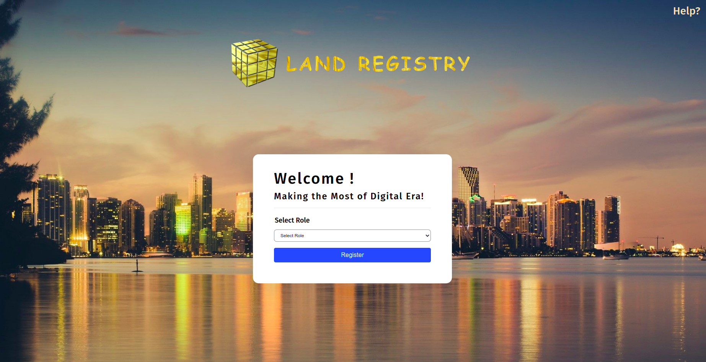
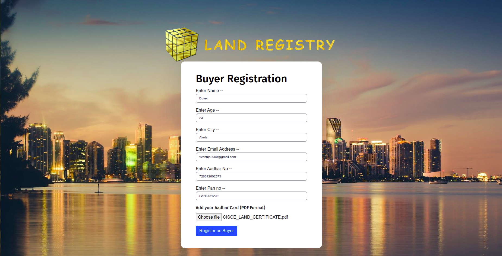
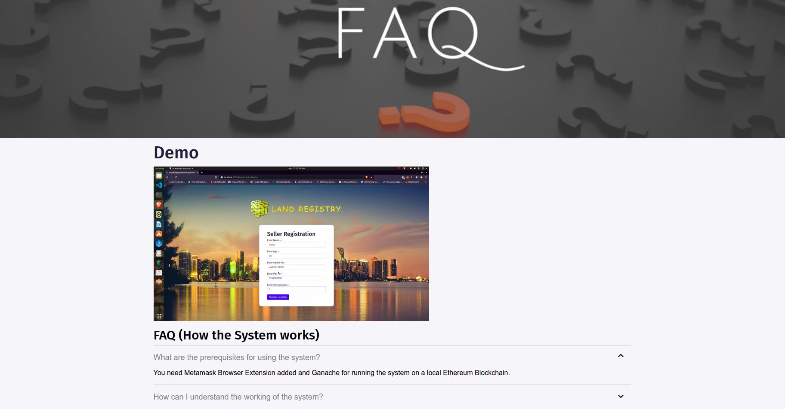
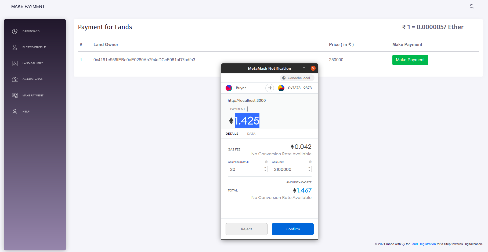
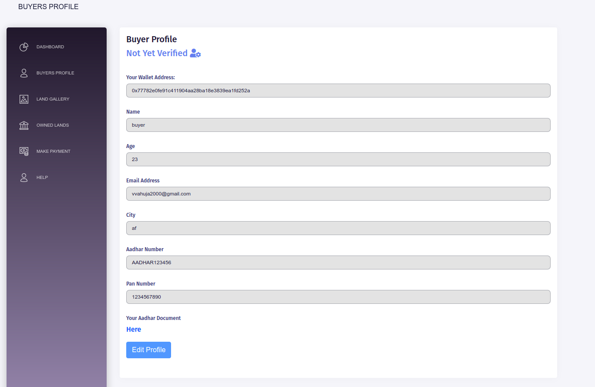

# Land Registration System with Blockchain  
## This work was presented at IEEE ICAECC'23 - <a href="https://ieeexplore.ieee.org/document/10560138">Checkout</a>
 

## Project Description:

This is an application of Land Registration System. 
Land registry in India as well as in many parts of the world is a very slow and inconvenient process. Current land registration & verification systems include an increasing number of fraud cases and loss of paperwork and court cases due to thousands of land records to maintain.  
The intuition behind building this was to make the process of land registration resilient and decreases the cases of fraud in the process. Using the system, validation of the lands is also possible as immutable transactions are being stored in the public ledger.  
So the Land Registration system using blockchain is a distributed system that will store all the transactions made during the process of land buying. This will also be helpful for buyers, sellers and government registrars to transfer the land ownership from seller to new buyer as well as it will accelerate the process of registration.  

## Tech Stack Used:

	Frontend:
	* Javascript
    * React Framework
	* CSS
    * Metamask Chrome Extension

	Backend:
	* Ethereum Blockchain (Truffle Suite)
    * Solidity
    * Ganache

## Application features:  

* **Registration Page**: Seller & Buyer can register for an account on the application. 
* **Land Inspector Dashboard**: Land Inspector works as the admin and is already registered. He can then verify the Sellers, Buyers and approve Land Transfer Process.
* **User Profile**: Seller & Buyer can view their profile via their respective Dashboards.
* **Edit Profile**: Seller & Buyer can edit their profile.
* **Seller Dashboard**: A Brief Description of Added Lands and features to Add a new Land and approve a Land request from a Buyer.
* **Add Land**: Seller can add a land after he/she is verified by the Land Inspector.
* **Approve Land Request**: Approve a Request by Buyer to Buy a Land.
* **Buyer Dashboard**: A Brief Description of all Lands and features to Request a Land to Land Owner of the particular Land. 
* **Owned Lands**: Details of Lands owned by the Buyer after Buying some lands.
* **Make Payment**: Complete Payment transfer to Seller after Land Request is approved.
* **View Lands**: Complete Information of Lands along with its Images and Required Documents.
* **Land Ownership Transfer**: Transfer of Land Ownership from Seller to Buyer via Land Inspector.  

## Steps to run the application:
1. Clone the github repository and cd to the folder 
2. Open _Ganache_ and keep it running in the Background.
3. Make sure you have Metamask Extension in your browser.
4. In the root directory run _truffle migrate --reset_.
5. cd to the _client_ folder and run _npm install_.
6. Run _npm start_.

## [Project Demo Link](https://youtu.be/6VLaAa8GNDc)

## Some features of the application:-

Landing Page                   |                   Buyer Registration
:---------------------------------:        |      :------------------------------:
  | 

Buyer Dashboard                   |                   Seller Dashboard
:---------------------------------:        |      :------------------------------:
     |

Add Land(by Seller)            |                   View all Lands Details
:---------------------------------:        |      :------------------------------:
     |

Help & FAQ Page                |                   Verify Buyer(by Land Inspector)
:---------------------------------:        |      :------------------------------:
     |

Approve Land Request(by Seller)               |             Payment by Buyer 
:---------------------------------:        |      :------------------------------:
     |

Verify Land Transaction(by Land Inspector)    |                   Owned Lands(Buyer)
:---------------------------------:        |      :------------------------------:
     |

View Profile(Before Verification)                  |             Edit Profile(After Verification)
:---------------------------------:        |      :------------------------------:
     |

### Make sure to star the repository if you find it helpful!

